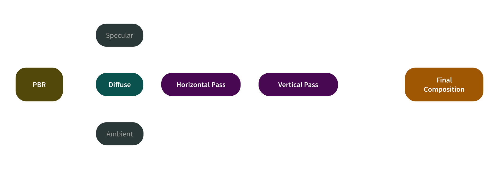

This project is an implementation of Jorge Jimenez's artist-friendly separable model in my [**seminar research paper**](/research/#real-time-subsurface-scattering-a-comparative-analysis). As a result, this post will solely focus on its implementation in Unity 6 without diving too deep into the theory behind it. 

The repository can be found [**here**]().

---

## Implementation Overview



Above is the overview of the entire pipeline at a high level which can be separated into three major steps:

1. **Split the lighting into separate buffers**: Separate the material into diffuse, specular, and ambient components.  
2. **Blur the diffuse lighting**: Soften the diffuse part by blurring it horizontally and then vertically to simulate light spreading beneath the surface.  
3. **Combine everything**: Recombine all components to produce the final image.

Now that we have the big picture, let's dive into the details.

---
## 1. Split the lighting into separate buffers
Our goal in this step is to neatly separate the diffuse, specular, and ambient components of the lighting for the next stage of our pipeline. This step is necessary since the subsurface scattering pass will only operate on the diffuse part of the lighting.

> Why diffuse part only?
> {: .title}
>
> In a normal diffuse lighting model, light is treated as if it enters and exits at the same surface point.
> Screen-space SSS modifies this by spreading the diffuse lighting into neighbouring pixels, creating the impression that light travelled underneath the surface.
> 
> Specular lighting is kept sharp because it represents direct surface reflection. Ambient lighting is kept separate so it can be added back in a controlled way after the SSS blur.
{: .box-info}

Normally, a fragment shader writes one final colour output to a single **colour target**. A colour target is a GPU-side destination that receives the colour values produced by the shader.

In HLSL, this is done through the [**`SV_Target`**](https://learn.microsoft.com/en-us/windows/win32/direct3dhlsl/dx-graphics-hlsl-semantics#system-value-semantics) semantic. `SV_Target0` refers to the first colour target of the current render pass. In Unity, that colour target is often a [**`RenderTexture`**](https://docs.unity3d.com/2022.2/Documentation/Manual/class-RenderTexture.html), allowing the rendered result to be reused by later shader passes.

For multiple render targets, we simply write to more outputs: `SV_Target1`, `SV_Target2`, and so on. Unity supports up to 8 colour targets in total, from `SV_Target0` to `SV_Target7`. In this implementation, we only need the first three for each of the lighting components.

Using [**this**]() PBR shader as a starting point, we can refactor the fragment output so each lighting component is written to its own colour target.

#### 1.1 Refactoring the fragment output

A standard lit fragment shader in HLSL usually returns one final colour:

```hlsl
float4 frag(Varyings IN) : SV_Target0
{
  ...
  float3 lighting = LightLoop(surfaceData, inputData);
  return float4(finalColour, 1);
}

```
Here, `LightLoop()` is the function that calculates the lighting. **// TODO: talk about surface data and input data**

This writes the final `float4` colour value into `SV_Target0` after all lighting calculations are complete. 

To split this up, we can define a custom fragment output `struct`. Each field is mapped to a different colour target.

```hlsl
// Define this before your fragment shader
struct FragOutput
{
  float4 diffuseBuffer: SV_Target0;
  float4 specularBuffer: SV_Target1;
  float4 ambientBuffer : SV_Target2;
};
```
We can then rewrite our fragment shader and `LightLoop()` to return a `FragOutput` instead of a `float4`.

```hlsl
FragOutput frag(Varyings IN)
{
  ...
  FragOutput o = LightLoop(surfaceData, inputData);
  return o;
}
```


---
## 2. Blur the diffuse lighting
---
## 3. Combine everything
