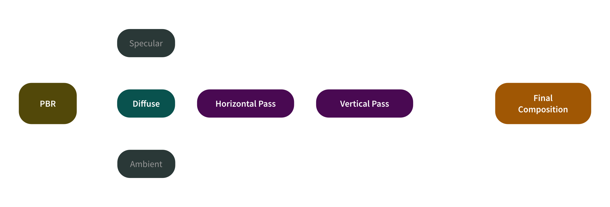

This project is an implementation of Jorge Jimenez's artist-friendly separable model in my [**seminar research paper**](/research/#real-time-subsurface-scattering-a-comparative-analysis). As a result, this post will solely focus on its implementation in Unity 6 without diving too deep into the theory behind it. 

The repository can be found [**here**]().

---

## Implementation Overview



Above is the overview of the entire pipeline at a high level which can be separated into three major steps:

1. **Split the lighting into separate buffers**: Separate the material into diffuse, specular, and ambient components.  
2. **Performing SSS**: Soften the diffuse part by blurring it horizontally and then vertically to simulate light spreading beneath the surface.  
3. **Compositing the SSS result**: Recombine all components to produce the final image.

Now that we have the big picture, let's dive into the details.

---
## 1. Split the lighting into separate buffers
Our goal in this step is to neatly separate the diffuse, specular, and ambient components of the lighting for the next stage of our pipeline. This step is necessary since the subsurface scattering pass will only operate on the diffuse part of the lighting.

> Why diffuse part only?
> {: .title}
>
> In a normal diffuse lighting model, light is treated as if it enters and exits at the same surface point.
> Screen-space SSS modifies this by spreading the diffuse lighting into neighbouring pixels, creating the impression that light travelled underneath the surface.
> 
> Specular lighting is kept sharp because it represents direct surface reflection. Ambient lighting is kept separate so it can be added back in a controlled way after the SSS blur.
{: .box-info}

Normally, a fragment shader writes one final colour output to a single **colour target**. A colour target is a GPU-side destination that receives the colour values produced by the shader.

In HLSL, this is done through the [**`SV_Target`**](https://learn.microsoft.com/en-us/windows/win32/direct3dhlsl/dx-graphics-hlsl-semantics#system-value-semantics) semantic. `SV_Target0` refers to the first colour target of the current render pass. In Unity, that colour target is often a [**`RenderTexture`**](https://docs.unity3d.com/2022.2/Documentation/Manual/class-RenderTexture.html), allowing the rendered result to be reused by later shader passes.

For multiple render targets, we simply write to more outputs: `SV_Target1`, `SV_Target2`, and so on. Unity supports up to 8 colour targets in total, from `SV_Target0` to `SV_Target7`. In this implementation, we only need the first three for each of the lighting components.

Using [**this**]() PBR shader as a starting point, we can refactor the fragment output so each lighting component is written to its own colour target. 


>Since this shader supports multiple lighting models, each with its own settings, I use a custom `ShaderGUI` to keep the material inspector clean and only show the controls relevant to the selected model. The script for this can be found [**here**]().
{:.prompt-info}

#### 1.1 Refactoring the fragment output

A standard lit fragment shader in HLSL usually returns one final colour:

```hlsl
float4 frag(Varyings IN) : SV_Target0
{
  ...
  float3 lighting = LightLoop(surfaceData, inputData);
  return float4(finalColour, 1);
}

```
Here, `LightLoop()` calculates the lighting using two structs: `inputData` and `surfaceData`.

`inputData` is mainly required by URP’s lighting system, especially the [**Forward+**](https://docs.unity3d.com/6000.3/Documentation/Manual/urp/rendering/forward-rendering-paths.html) light loop. `surfaceData` is our own shader data struct, used to store the material information needed by our lighting functions. There is some overlap between them, such as position, normal, and view direction. That is fine: `inputData` is for URP, while `surfaceData` is for our own lighting code.

The shader currently writes the final `float4` colour value into `SV_Target0` after all lighting calculations are complete. To split this up, we can define a custom fragment output `struct` with each field mapped to a different colour target:

```hlsl
// Define this before your fragment shader
struct FragOutput
{
  float4 diffuseBuffer: SV_Target0;
  float4 specularBuffer: SV_Target1;
  float4 ambientBuffer : SV_Target2;
};
```
We can then rewrite our fragment shader and `LightLoop()` to return a `FragOutput` instead of a `float4`:

```hlsl
FragOutput frag(Varyings IN)
{
  ...
  FragOutput o = LightLoop(surfaceData, inputData);
  return o;
}
```

The same refactor also has to happen inside `LightLoop()` where each component of the lighting is accumulated in separate buckets. For the full shader changes, compare [**`SSSS Master.shader`**](...) with [**`PBR Master.shader`**](...).

#### 1.2 Creating the lighting buffers

By using the `SV_Target[i]` semantics, we have only labelled where each output should be written.

So far, only our diffuse output will render because `SV_Target0` is usually bound to the camera colour target in normal render passes. Since nothing stores the other specular and ambient lighting information, the other two colour targets won't be rendered.

To fix this, we must create our own custom render pass that properly receives all three outputs as separate render textures. This can be done in Unity 6 by creating a custom [**`ScriptableRenderFeature`**](https://docs.unity3d.com/Packages/com.unity.render-pipelines.universal@17.3/api/UnityEngine.Rendering.Universal.ScriptableRendererFeature.html) with a [**`ScriptableRenderPass`**](https://docs.unity3d.com/Packages/com.unity.render-pipelines.universal@17.3/api/UnityEngine.Rendering.Universal.ScriptableRenderPass.html). A `ScriptableRenderFeature` is a component that can be added to a scriptable renderer like URP to modify how the scene is rendered. It configures and enqueues render passes that ~~contain the actual rendering work.~~ ***the shaders do <- improve explanation.***

> How to remember the difference?
> {: .title}
> 
> `ScriptableRenderFeature` tells URP: *“Please insert this custom rendering operation into the renderer.”*
> 
> `ScriptableRenderPass` tells URP: *“Here is what to do when that operation runs.”*
{: .box-tip}

##### 1.21 Setting up the render feature

In our case, we want a render feature that tells URP to insert our custom lighting pipeline into the renderer. This pipeline captures the diffuse, specular, and ambient lighting buffers, processes the diffuse buffer for subsurface scattering, and then combines everything back into the final image. It is also here where we allow the user to customise the settings for how the subsurface scattering should look.

This is mostly boilerplate. It simply creates our custom render pass, gives it our settings, and inserts it into URP. For the basic steps of adding a render feature to URP, see [**this**](https://docs.unity3d.com/Packages/com.unity.render-pipelines.universal@16.0/manual/urp-renderer-feature-how-to-add.html). 

Below are the exposed SSS settings, followed by the full code:

| Setting            | Type / Range | What it controls                                                                                                                                                                |
| ------------------ | ------------ | ------------------------------------------------------------------------------------------------------------------------------------------------------------------------------- |
| `subsurfaceWeight` | `0.0 – 1.0`  | Controls how strongly the blurred subsurface result is blended into the final image. `0.0` gives the original unblurred diffuse lighting, while `1.0` uses the full SSS result. |
| `scatterScale`     | `0.0 – 10.0` | Globally scales how far the scattering spreads. Higher values make the effect wider, softer, and more translucent.                                                              |
| `nearFarBalance`   | `0.0 – 1.0`  | Blends between wide scattering and tight scattering. Lower values give softer, wider scattering. Higher values keep the effect closer to the original surface detail.           |
| `nearSigma`        | `Vector4`    | Controls the tight scattering colour. This keeps the effect close to the original pixel and preserves sharper detail.                                                           |
| `farSigma`         | `Vector4`    | Controls the wide scattering colour. This spreads light further and creates softer colour bleeding.                                                                             |
| `stepCount`        | `int`        | Sets the number of samples used by the blur kernel.                                                                                                                             |

<details class="collapsible" markdown="1">
<summary>
  <span class="collapsible-label">Show:</span>
  <span class="collapsible-meta"><code>SSSSRenderFeature.cs</code></span>
</summary>

```csharp
using UnityEngine;
using UnityEngine.Rendering.Universal;

[System.Serializable]
public class SSSSSettings
{
    [Header("Scattering")]

    // Blends between the original diffuse lighting and the blurred SSS result.
    // 0 = no visible subsurface scattering, 1 = full subsurface scattering.
    [Range(0.0f, 1.0f)]
    public float subsurfaceWeight = 1f;

    // Global multiplier for the scattering radius.
    // Higher values make light spread further across the surface.
    [Range(0.0f, 10.0f)]
    public float scatterScale = 2.0f;

    // Controls the blend between the far and near scattering profiles.
    // 0 = mostly far/wide scattering, 1 = mostly near/tight scattering.
    [Range(0.0f, 1.0f)]
    public float nearFarBalance = 0.5f;

    // RGB standard deviations for the near scattering Gaussian.
    // Smaller values preserve sharper details and keep scattering close to the source pixel.
    public Vector4 nearSigma = new Vector4(0.35f, 0.07f, 0.035f, 1.0f);

    // RGB standard deviations for the far scattering Gaussian.
    // Larger values create wider colour bleeding and softer diffusion.
    public Vector4 farSigma = new Vector4(1.00f, 0.12f, 0.10f, 1.0f);

    // Number of samples used by the blur kernel.
    // Hidden because this is currently fixed internally rather than exposed as an artist setting.
    public int stepCount = 32;
}

public class SSSSRenderFeature : ScriptableRendererFeature
{
    [SerializeField] private Material SSSSMaterial;
    [SerializeField] private Material compositeMaterial;
    [SerializeField] private SSSSSettings settings = new SSSSSettings();

    private SSSSRenderPass renderPass;

    public override void Create()
    {
        // Create the render pass once when the feature is initialised.
        renderPass = new SSSSRenderPass(SSSSMaterial, compositeMaterial, settings);

        // Run the SSSS pass after opaque objects have been rendered.
        renderPass.renderPassEvent = RenderPassEvent.AfterRenderingOpaques;
    }

    public override void AddRenderPasses(ScriptableRenderer renderer, ref RenderingData renderingData)
    {
        // Do not enqueue the pass if the SSS blur material is missing.
        if (SSSSMaterial == null)
        {
            Debug.LogError("SSSSRenderFeature: SSSS material is null.");
            return;
        }

        // Do not enqueue the pass if the final composite material is missing.
        if (compositeMaterial == null)
        {
            Debug.LogError("SSSSRenderFeature: Composite material is null.");
            return;
        }

        // Recreate the pass if Unity has lost or reset the cached instance.
        if (renderPass == null)
        {
            renderPass = new SSSSRenderPass(SSSSMaterial, compositeMaterial, settings);
            renderPass.renderPassEvent = RenderPassEvent.AfterRenderingOpaques;
        }

        // We will create these setters in the next step in SSSSRenderPass.
        renderPass.SetMaterials(SSSSMaterial, compositeMaterial);
        renderPass.SetSettings(settings);

        // Add the pass to the renderer for this frame.
        renderer.EnqueuePass(renderPass);
    }

    protected override void Dispose(bool disposing)
    {
        // Release any temporary render targets or pass-owned resources.
        if (disposing && renderPass != null)
            renderPass.Dispose();
    }
}
```
</details>

Nothing particularly SSSS-specific happens inside the `ScriptableRenderFeature`, so we can move on quickly.

The important part is the `ScriptableRenderPass`. This is where we actually create the lighting buffers, bind them as render targets, run the blur passes, and composite the final image.

##### 1.22 Setting up the render pass

In Unity 6, the `ScriptableRenderPass` workflow has changed slightly. In older URP versions, a custom pass usually meant giving Unity a sequence of rendering commands and manually managing temporary render textures yourself.

With RenderGraph, we instead describe the pass through `RecordRenderGraph()`. Each pass declares which textures it reads from and writes to, allowing Unity to manage resource lifetimes, pass ordering, and optimisation more safely.

For our SSS pipeline, the render pass has **six main parts**:

1. Apply our settings to the shaders.
2. Create temporary lighting buffers.
3. Render the SSS objects into separate diffuse, specular, and ambient textures.
4. Performing SSS
   1. Blur the diffuse texture horizontally.
   2. Blur the result vertically.
5. Composite the blurred diffuse lighting with the other lighting components.
6. Blitt the final texture into the scene texture.

A line-by-line walkthrough would make this devlog too long, so I’ve included the script below with the key sections commented for clarity.

<details class="collapsible" markdown="1">
<summary>
  <span class="collapsible-label">Show:</span>
  <span class="collapsible-meta"><code>SSSSRenderPass.cs</code></span>
</summary>

```csharp
using UnityEngine;
using UnityEngine.Rendering;
using UnityEngine.Rendering.RenderGraphModule;
using UnityEngine.Rendering.Universal;

public class SSSSRenderPass : ScriptableRenderPass
{
    private Material compositeMaterial;
    private Material SSSSMaterial;
    private SSSSSettings settings;

    // Shared global SSSS properties.
    // These are read by ArtistFriendlyKernel.shader, Compositor.shader and SSSSTransmission.hlsl.
    private static readonly int GlobalSubsurfaceWeight = Shader.PropertyToID("_SSSS_SubsurfaceWeight");
    private static readonly int GlobalNearFarBalanceID = Shader.PropertyToID("_SSSS_NearFarBalance");
    private static readonly int GlobalScatterScaleID = Shader.PropertyToID("_SSSS_ScatterScale");
    private static readonly int GlobalNearSigmaID = Shader.PropertyToID("_SSSS_NearSigma");
    private static readonly int GlobalFarSigmaID = Shader.PropertyToID("_SSSS_FarSigma");
    private static readonly int GlobalStepCountID = Shader.PropertyToID("_SSSS_StepCount");

    // Stores MRT textures so the later composite pass can read them in the same frame.
    private class SSSSFrameData : ContextItem
    {
        public TextureHandle diffuseTexture;
        public TextureHandle processedDiffuseTexture;
        public TextureHandle specularTexture;
        public TextureHandle ambientTexture;

        public override void Reset()
        {
            diffuseTexture = TextureHandle.nullHandle;
            specularTexture = TextureHandle.nullHandle;
            ambientTexture = TextureHandle.nullHandle;
            processedDiffuseTexture = TextureHandle.nullHandle;
        }
    }

    // Data containers used by the individual RenderGraph passes.
    // These carry textures, materials, or renderer lists from pass setup into execution.

    private class MRTPassData
    {
        public RendererListHandle rendererList;
    }

    private class SSSSPassData
    {
        public TextureHandle inputTexture;
        public Material material;
    }

    private class CompositePassData
    {
        public TextureHandle sceneTexture;
        public TextureHandle diffuseTexture;
        public TextureHandle processedDiffuseTexture;
        public TextureHandle specularTexture;
        public TextureHandle ambientTexture;
        public Material compositeMaterial;
    }

    private class FinalBlitPassData
    {
        public TextureHandle sourceTexture;
        public Material blitMaterial;
    }

    private void ApplyGlobalSettings()
    {
        Shader.SetGlobalFloat(GlobalSubsurfaceWeight, settings.subsurfaceWeight);
        Shader.SetGlobalFloat(GlobalNearFarBalanceID, settings.nearFarBalance);
        Shader.SetGlobalVector(GlobalNearSigmaID, settings.nearSigma);
        Shader.SetGlobalVector(GlobalFarSigmaID, settings.farSigma);
        Shader.SetGlobalFloat(GlobalScatterScaleID, settings.scatterScale);
        Shader.SetGlobalInt(GlobalStepCountID, settings.stepCount);
    }

    public SSSSRenderPass(Material SSSSMaterial, Material compositeMaterial, SSSSSettings settings)
    {
        this.SSSSMaterial = SSSSMaterial;
        this.compositeMaterial = compositeMaterial;
        this.settings = settings;
    }

    public void SetMaterials(Material ssssMaterial, Material compositeMaterial)
    {
        this.SSSSMaterial = ssssMaterial;
        this.compositeMaterial = compositeMaterial;
    }

    public void SetSettings(SSSSSettings settings)
    {
        this.settings = settings;
    }

    public override void RecordRenderGraph(RenderGraph renderGraph, ContextContainer frameData)
    {
        // 1) Apply global settings to ArtistFriendlyKernel.shader, SSSSTransmission.hlsl and Compositor.shader
        ApplyGlobalSettings();

        UniversalRenderingData renderingData = frameData.Get<UniversalRenderingData>();
        UniversalCameraData cameraData = frameData.Get<UniversalCameraData>();
        UniversalLightData lightData = frameData.Get<UniversalLightData>();
        UniversalResourceData resourceData = frameData.Get<UniversalResourceData>();

        // 2) Setup: Create MRT textures matching the camera target.
        RenderTextureDescriptor desc = cameraData.cameraTargetDescriptor;
        desc.depthBufferBits = 0;
        desc.msaaSamples = 1;

        TextureHandle ambientTexture = UniversalRenderer.CreateRenderGraphTexture(renderGraph, desc, "_SSSSAmbientTexture", false);
        TextureHandle diffuseTexture = UniversalRenderer.CreateRenderGraphTexture(renderGraph, desc, "_SSSSDiffuseTexture", false);
        TextureHandle horizontalTempTexture = UniversalRenderer.CreateRenderGraphTexture(renderGraph, desc, "_SSSSHorizontalTempTexture", false);
        TextureHandle processedDiffuseTexture = UniversalRenderer.CreateRenderGraphTexture(renderGraph, desc, "_SSSSProcessedDiffuseTexture", false);
        TextureHandle specularTexture = UniversalRenderer.CreateRenderGraphTexture(renderGraph, desc, "_SSSSSpecularTexture", false);
        TextureHandle compositeOutputTexture = UniversalRenderer.CreateRenderGraphTexture(renderGraph, desc, "_SSSSCompositeOutputTexture", false);

        // Make them available to later passes in this frame.
        SSSSFrameData customData = frameData.Create<SSSSFrameData>();
        customData.diffuseTexture = diffuseTexture;
        customData.processedDiffuseTexture = processedDiffuseTexture;
        customData.specularTexture = specularTexture;
        customData.ambientTexture = ambientTexture;

        // 3) MRT pass: attach ambient, diffuse, specular into separate render textures for SSS processing
        using (var builder = renderGraph.AddRasterRenderPass<MRTPassData>("SSSS MRT Pass", out var passData))
        {
            ShaderTagId shaderTag = new ShaderTagId("UniversalForward");

            SortingCriteria sortFlags = cameraData.defaultOpaqueSortFlags;
            FilteringSettings filteringSettings = new FilteringSettings(RenderQueueRange.opaque, LayerMask.GetMask("SSSS"));

            DrawingSettings drawingSettings = RenderingUtils.CreateDrawingSettings(
                shaderTag,
                renderingData,
                cameraData,
                lightData,
                sortFlags
            );

            RendererListParams rendererListParams = new RendererListParams(
                renderingData.cullResults,
                drawingSettings,
                filteringSettings
            );

            // Create the renderer list, store it in passData, then register it with the builder.
            passData.rendererList = renderGraph.CreateRendererList(rendererListParams);
            builder.UseRendererList(passData.rendererList);

            // MRT bindings:
            // SV_Target0 -> diffuseTexture
            // SV_Target1 -> specularTexture
            // SV_Target2 -> ambientTexture
            builder.SetRenderAttachment(diffuseTexture, 0);
            builder.SetRenderAttachment(specularTexture, 1);
            builder.SetRenderAttachment(ambientTexture, 2);

            // Use the active depth buffer so geometry depth-tests correctly.
            builder.SetRenderAttachmentDepth(resourceData.activeDepthTexture, AccessFlags.ReadWrite);

            // Keep this on while debugging so RenderGraph does not cull the pass away.
            builder.AllowPassCulling(false);

            // Define the actual GPU commands for this pass.
            // The MRTPassData filled above is received here as 'data'.
            builder.SetRenderFunc(static (MRTPassData data, RasterGraphContext context) =>
            {
                context.cmd.ClearRenderTarget(false, true, Color.black);
                context.cmd.DrawRendererList(data.rendererList);
            });
        }

        // 4a) SSS horizontal pass: Apply horizontal SSS pass onto diffuse texture and output it to horizontalTempTexture.
        using (var builder = renderGraph.AddRasterRenderPass<SSSSPassData>("SSSS SSS Horizontal Pass", out var passData))
        {
            // Setup the data needed when the pass executes.
            passData.inputTexture = diffuseTexture;
            passData.material = SSSSMaterial;

            // Declare the texture read and output target.
            builder.UseTexture(passData.inputTexture);
            builder.SetRenderAttachment(horizontalTempTexture, 0);

            builder.AllowPassCulling(false);

            // Execute material pass 0, which performs the horizontal SSS blur.
            builder.SetRenderFunc(static (SSSSPassData data, RasterGraphContext context) =>
            {
                data.material.SetTexture("_MainTex", data.inputTexture);
                Blitter.BlitTexture(context.cmd, data.inputTexture, new Vector4(1, 1, 0, 0), data.material, 0);
            });
        }

        // 4b) SSS vertical pass: Apply vertical SSS pass onto 3a's texture and output it to processedDiffuseTexture.
        using (var builder = renderGraph.AddRasterRenderPass<SSSSPassData>("SSSS SSS Vertical Pass", out var passData))
        {
            passData.inputTexture = horizontalTempTexture;
            passData.material = SSSSMaterial;

            builder.UseTexture(passData.inputTexture);
            builder.SetRenderAttachment(processedDiffuseTexture, 0);
            builder.AllowPassCulling(false);

            builder.SetRenderFunc(static (SSSSPassData data, RasterGraphContext context) =>
            {
                data.material.SetTexture("_MainTex", data.inputTexture);
                Blitter.BlitTexture(context.cmd, data.inputTexture, new Vector4(1, 1, 0, 0), data.material, 1);
            });
        }

        // 5) Composite pass: Combine processedDiffuseTexture with specularTexture and apply the masked result into compositeOutputTexture
        using (var builder = renderGraph.AddRasterRenderPass<CompositePassData>("SSSS Composite Pass", out var passData))
        {
            // Retrieve the textures created earlier in this frame.
            // These were written by the MRT and blur passes.
            SSSSFrameData custom = frameData.Get<SSSSFrameData>();

            // Data needed when the composite pass executes.
            passData.sceneTexture = resourceData.activeColorTexture;
            passData.diffuseTexture = custom.diffuseTexture;
            passData.processedDiffuseTexture = custom.processedDiffuseTexture;
            passData.specularTexture = custom.specularTexture;
            passData.ambientTexture = custom.ambientTexture;
            passData.compositeMaterial = compositeMaterial;

            // Declare all texture reads.
            builder.UseTexture(passData.sceneTexture);
            builder.UseTexture(passData.diffuseTexture);
            builder.UseTexture(passData.processedDiffuseTexture);
            builder.UseTexture(passData.specularTexture);
            builder.UseTexture(passData.ambientTexture);

            // Store the composited result in compositeOutputTexture.
            builder.SetRenderAttachment(compositeOutputTexture, 0);

            builder.AllowPassCulling(false);

            // Run composite material pass 0.
            builder.SetRenderFunc(static (CompositePassData data, RasterGraphContext context) =>
            {
                data.compositeMaterial.SetTexture("_SceneTex", data.sceneTexture);
                data.compositeMaterial.SetTexture("_DiffuseTex", data.diffuseTexture);
                data.compositeMaterial.SetTexture("_ProcessedDiffuseTex", data.processedDiffuseTexture);
                data.compositeMaterial.SetTexture("_SpecularTex", data.specularTexture);
                data.compositeMaterial.SetTexture("_AmbientTex", data.ambientTexture);
                Blitter.BlitTexture(context.cmd, data.sceneTexture, new Vector4(1, 1, 0, 0), data.compositeMaterial, 0);
            });
        }

        // 6) Final pass: Blit compositeOutputTexture into resourceData.activeColorTexture
        // We cannot sample activeColorTexture and write back into it in the same composite pass.
        // Therefore, we write the composite pass to compositeOutputTexture in 4) first,
        // then use this pass to copy that result back into activeColorTexture.
        using (var builder = renderGraph.AddRasterRenderPass<FinalBlitPassData>("SSSS Final Blit Pass", out var passData))
        {
            passData.sourceTexture = compositeOutputTexture;
            passData.blitMaterial = compositeMaterial;

            builder.UseTexture(passData.sourceTexture);
            builder.SetRenderAttachment(resourceData.activeColorTexture, 0);
            builder.AllowPassCulling(false);

            // Material pass 1 handles the copying.
            builder.SetRenderFunc(static (FinalBlitPassData data, RasterGraphContext context) =>
            {
                Blitter.BlitTexture(
                    context.cmd,
                    data.sourceTexture,
                    new Vector4(1, 1, 0, 0),
                    data.blitMaterial,
                    1
                );
            });
        }
    }

    public void Dispose()
    {
        // Nothing manual to release here. RenderGraph owns the temporary textures.
    }
}
```
</details>

------------- *Show diffuse, ambient and specular parts* -------------

---
## 2. Performing SSS

With the RenderGraph pipeline setup now, you may have also noticed that in `SSSSRenderPass.cs`, we had references to several materials in section 4, 5 and 6. These are intentional. They are custom shader materials used to **perform the actual image processing work** in those passes. Here, we will write our custom shader for our separable subsurface scattering using Jorge Jimenez's artist friendly kernel. 

Jorge Jimenez's paper on [**separable subsurface scattering**](https://www.cg.tuwien.ac.at/research/publications/2015/Jimenez_SSS_2015/Jimenez_SSS_2015-paper.pdf#page=0.99) shows us how subsurface scattering can be approximated not only more efficiently but also more physically accurate in screen space. 

At a high level, an expensive approach would be a full 2D convolution with a diffusion profile. However, Jimenez et al. show that this can be sped up using two cheaper 1D passes: one along the horizontal axis and one along the vertical axis. This works under useful assumptions about how irradiance behaves across the surface. This result is introduced through the **pre-integrated kernel**.

For our actual shader, I use the paper's **artist-friendly model**. It follows the same separable two-pass structure, but trades off some physical accuracy for more intuitive controls so that we can tweak the aesthetics of the results better. 

#### 2.1 The kernel

Our 1D kernel is a weighted blend of a near-range and far-range Gaussian:

$$
G(r,\sigma)
=
\frac{1}{\sqrt{2\pi}\sigma}
e^{-\frac{r^2}{2\sigma^2}}
$$

To keep the profile artist-controllable, I scale both Gaussian widths by a global scattering radius:

$$
\sigma'_\text{near}
=
\sigma_\text{near}
\cdot s
$$

$$
\sigma'_\text{far}
=
\sigma_\text{far}
\cdot s
$$

where $$s = \text{_SSSS_ScatterScale}$$. The kernel then becomes:

$$
a(r)
=
wG(r,\sigma'_\text{near})
+
(1-w)G(r,\sigma'_\text{far})
$$

Here, $$w$$ controls the balance between short-range and long-range scattering, while $$\sigma'_\text{near}$$ and $$\sigma'_\text{far}$$ control the width of the near and far Gaussians respectively. 

The full separable 2D kernel is simply:

$$
A(x,y) = a(x)a(y)
$$

which is represented implicitly in the code later by applying the same 1D convolution twice.

#### 2.2 The 1D Convolutions

Before we can write the code, we must firstly understand how the convolution works. 

Again at a high level, convolution means that for each pixel, we look at nearby samples and give each one a weight. Each sample colour is multiplied by its weight, and all weighted samples are then summed together to produce the new colour of the current pixel. Samples close to the centre usually contribute more, while samples further away contribute less. For our SSS blur, those weights come from the artist-friendly kernel described above.

For one horizontal or vertical pass, we can write the continuous 1D convolution as:

$$
M_e(u)
=
\int_{-\infty}^{\infty}
E(u')a(u-u')\,du'
$$

This looks scary but it just means: to compute the new diffuse colour $$M_e(u)$$, we add up infinitely many neighbouring colours. Each neighbour is multiplied by a scattering weight from the kernel $$a$$, based on how far that neighbour is from $$u$$. 

This makes sense because light can enter at one point of a material like skin, scatter internally, and exit somewhere nearby. The final colour at a point depends on the light received by its surrounding neighbours too.

In code, however, we cannot sample infinitely many points. So we approximate the integral with a finite weighted sum:

$$
M_e(u)
\approx
\frac{
\sum_{i=-N}^{N}
E(u_i)\,a(u-u_i)
}{
\sum_{i=-N}^{N}
a(u-u_i)
}
$$

Here, we only consider a fixed number of samples $$N$$ on each side of the pixel $$u$$. The numerator sums them up and the denominator normalises them so that the brightness stays stable when we adjust the kernel parameters.

As shown in section 4a and 4b in `SSSSRenderPass.cs`, this shader is used through a material `SSSSMaterial`. The convolution is performed twice: once for horizontal and once for vertical. The code remains the same, only the direction changes.
 
<details class="collapsible" markdown="1">
<summary>
  <span class="collapsible-label">Show:</span>
  <span class="collapsible-meta"><code>ArtistFriendlyKernel.shader</code></span>
</summary>

```hlsl
Shader "bentoBAUX/SSSS Util/ArtistFriendlyKernel"
{
    HLSLINCLUDE
    #include "Packages/com.unity.render-pipelines.universal/ShaderLibrary/Core.hlsl"
    #include "Packages/com.unity.render-pipelines.core/Runtime/Utilities/Blit.hlsl"

    float _SSSS_NearFarBalance;
    float3 _SSSS_NearSigma;
    float3 _SSSS_FarSigma;
    float _SSSS_ScatterScale;
    int _SSSS_StepCount;

    SAMPLER(sampler_BlitTexture);

    float Gaussian1D(float r, float sigma)
    {
        const float INV_SQRT_2PI = 0.3989422804;
        return INV_SQRT_2PI / sigma * exp(-(r * r) / (2.0 * sigma * sigma));
    }

    float4 Convolve(float2 uv, float2 direction)
    {
        float2 texelSize = 1.0 / _ScreenParams.xy;

        float3 sum = 0.0;
        float3 totalWeight = 0.;

        float balance = saturate(_SSSS_NearFarBalance);

        float spreadMultiplier = 2; // I have added a spread multiplier for aesthetics reasons.
        float scatterRadius = max(_SSSS_ScatterScale * spreadMultiplier, 0.01);

        float3 nearSigma = max(_SSSS_NearSigma.rgb * scatterRadius, 0.01);
        float3 farSigma = max(_SSSS_FarSigma.rgb * scatterRadius, 0.01);

        for (int i = -_SSSS_StepCount; i <= _SSSS_StepCount; i++)
        {
            float offset = abs((float)i);

            // Move along the chosen blur axis and keep samples inside the screen.
            float2 sampleUV = clamp(uv + direction * texelSize * i, 0., 1.);
            float3 sampleColour = SAMPLE_TEXTURE2D(_BlitTexture, sampler_BlitTexture, sampleUV).rgb;

            // Calculate the weights w_i of u's every neighbouring pixels u_i.
            float3 w_i;
            w_i.r = balance * Gaussian1D(offset, max(nearSigma.r, 0.01)) + (1 - balance) * Gaussian1D(offset, max(farSigma.r, 0.01));
            w_i.g = balance * Gaussian1D(offset, max(nearSigma.g, 0.01)) + (1 - balance) * Gaussian1D(offset, max(farSigma.g, 0.01));
            w_i.b = balance * Gaussian1D(offset, max(nearSigma.b, 0.01)) + (1 - balance) * Gaussian1D(offset, max(farSigma.b, 0.01));

            // Accumulate the weighted colour and track the total weight for normalisation.
            sum += sampleColour * w_i;
            totalWeight += w_i;
        }

        return float4(sum / max(totalWeight, 0.0001), 1.0);
    }

    float4 HorizontalBlur(Varyings input) : SV_Target
    {
        return Convolve(input.texcoord, float2(1, 0));
    }

    float4 VerticalBlur(Varyings input) : SV_Target
    {
        return Convolve(input.texcoord, float2(0, 1));
    }
    ENDHLSL

    SubShader
    {
        Tags
        {
            "RenderPipeline" = "UniversalPipeline"
        }
        ZWrite Off
        ZTest Always
        Cull Off

        // Pass 0 performs the horizontal blur
        Pass
        {
            Name "Horizontal Blur"
            HLSLPROGRAM
            #pragma vertex Vert
            #pragma fragment HorizontalBlur
            ENDHLSL
        }

        // Pass 1 performs the vertical blur
        Pass
        {
            Name "Vertical Blur"
            HLSLPROGRAM
            #pragma vertex Vert
            #pragma fragment VerticalBlur
            ENDHLSL
        }
    }
}
```
</details>

------------- *Show intermediate result* ------------- 

---
## 3. Compositing the SSS result

Now that we have finished adding subsurface scattering to our diffuse lighting, we need to put everything back together. According to our setup in section 5 of `SSSSRenderPass.cs`, we should now have five textures:

- `_SceneTex`: The current camera colour texture before the final SSS composite. This is our base image that also includes the diffuse texture of our SSS objects.
- `_DiffuseTex`: The unprocessed diffuse lighting of SSS objects.
- `_ProcessedDiffuseTex`: The diffuse lighting after two SSS blur passes.
- `_SpecularTex`: The specular lighting of SSS objects.  
- `_AmbientTex`: The ambient or indirect lighting of the SSS objects. 

To replace the pixels that belong to our SSS objects while leaving everything else untouched, we need a mask. We can create this from `_DiffuseTex`. Mathematically, we want to assign binary values to our mask $$m$$. $$m=1$$ if `_DiffuseTex` contains the slightest bit of lighting and $$m=0$$ when it is completely black:

$$
m
=
\operatorname{step}
\left(
\epsilon,
\max(D_r, D_g, D_b)
\right)
=
\begin{cases}
0, & \max(D_r, D_g, D_b) < \epsilon \\
1, & \max(D_r, D_g, D_b) \ge \epsilon
\end{cases}

\qquad
\epsilon = 0.0001
$$

To blend between normal diffuse and the SSS output, we do a simple linear interpolation:

$$
D_\text{sss}
=
\operatorname{lerp}
\left(
D,
D_\text{blurred},
w
\right)
=
(1-w)D
+
wD_\text{blurred}
$$

$$
w = \text{_SSSS_SubsurfaceWeight}
$$

Finally, we recombine $$D_\text{sss}$$ with the rest of the scene with another lerp:

$$
C_\text{final}
=
\operatorname{lerp}
\left(
C_\text{scene},
C_\text{sss},
m
\right)
=
(1-m)C_\text{scene}
+
mC_\text{sss}
$$

$$
C_\text{sss}
=
D_\text{sss}
+
S
+
A
$$

Here, if $$m=1$$, $$C_\text{final}=C_\text{scene}$$. Else, $$C_\text{final}=C_\text{sss}$$.

Below is the translation into code:

<details class="collapsible" markdown="1">
<summary>
  <span class="collapsible-label">Show:</span>
  <span class="collapsible-meta"><code>Compositor.shader</code></span>
</summary>

```hlsl
Shader "bentoBAUX/SSSS Util/Compositor"
{
    HLSLINCLUDE
    #include "Packages/com.unity.render-pipelines.universal/ShaderLibrary/Core.hlsl"
    #include "Packages/com.unity.render-pipelines.core/Runtime/Utilities/Blit.hlsl"

    TEXTURE2D(_SceneTex);
    SAMPLER(sampler_SceneTex);

    TEXTURE2D(_DiffuseTex);
    SAMPLER(sampler_DiffuseTex);

    TEXTURE2D(_ProcessedDiffuseTex);
    SAMPLER(sampler_ProcessedDiffuseTex);

    TEXTURE2D(_SpecularTex);
    SAMPLER(sampler_SpecularTex);

    TEXTURE2D(_AmbientTex);
    SAMPLER(sampler_AmbientTex);

    float _SSSS_SubsurfaceWeight;

    float4 CompositeFrag(Varyings input) : SV_Target
    {
        float2 uv = input.texcoord;

        float3 sceneColour = SAMPLE_TEXTURE2D(_SceneTex, sampler_SceneTex, uv).rgb;
        float3 diffuse = SAMPLE_TEXTURE2D(_DiffuseTex, sampler_DiffuseTex, uv).rgb;
        float3 processed = SAMPLE_TEXTURE2D(_ProcessedDiffuseTex, sampler_ProcessedDiffuseTex, uv).rgb;
        float3 specular = SAMPLE_TEXTURE2D(_SpecularTex, sampler_SpecularTex, uv).rgb;
        float3 ambient = SAMPLE_TEXTURE2D(_AmbientTex, sampler_AmbientTex, uv).rgb;

        // Use the diffuse buffer as a simple mask for pixels rendered by the SSS shader.
        float maskSource = max(diffuse.r, max(diffuse.g, diffuse.b));
        float mask = step(0.0001, maskSource);

        // Blend between the original diffuse lighting and the blurred SSS result.
        float3 sssRatio = lerp(diffuse, processed, _SSSS_SubsurfaceWeight);

        // Recombine the blurred diffuse with the sharp lighting components.
        float3 sssColour = sssRatio + specular + ambient;

        // Keep non-SSS scene objects untouched.
        float3 finalColour = lerp(sceneColour, sssColour, mask);

        return float4(finalColour, 1.0);
    }

    float4 CopyFrag(Varyings input) : SV_Target
    {
        return SAMPLE_TEXTURE2D(_BlitTexture, sampler_LinearClamp, input.texcoord);
    }
    ENDHLSL

    SubShader
    {
        Tags
        {
            "RenderPipeline"="UniversalPipeline"
        }

        ZWrite Off
        ZTest Always
        Cull Off

        // Material pass 0 is our compositor.
        Pass
        {
            Name "Composite"

            HLSLPROGRAM
            #pragma vertex Vert
            #pragma fragment CompositeFrag
            ENDHLSL
        }

        // Material pass 1 copies the output from the compositor into the active screen texture.
        Pass
        {
            Name "Copy"

            HLSLPROGRAM
            #pragma vertex Vert
            #pragma fragment CopyFrag
            ENDHLSL
        }
    }
}
```
</details>

There is one last RenderGraph detail in `SSSSRenderPass.cs`. We cannot safely read from the `resourceData.activeColorTexture` and write back into that same texture in the same pass. The `CompositeFrag()` therefore writes into a temporary output texture first. After that, we run `CopyFrag()` that copies this temporary result back into the active scene colour texture.


## BONUS: Transmission

At this point, the screen-space SSS pipeline is working. However, this only handles light scattering across the visible surface. It **does not include backlighting effect** you often see around ears, fingers, or thin skin regions. That kind of effect depends on light travelling through the object, which our screen-space blur does not know about.

To approximate this, I added a simple backlighting term directly in `SSSS Master.shader`, based on Jorge Jimenez’s translucency approximation from his [**website**](https://www.iryoku.com/translucency/?utm_source=openai). Instead of using his original falloff directly, I adapted it into a custom sigma-driven falloff so the transmission response stays consistent with our near/far SSS profile.

**`CalculateTransmittance()` should be added to the diffuse buffer of the master shader.**

> Only add it to the diffuse buffer!
> {: .title}
> The transmittance term must be written into the diffuse buffer before the SSS blur pass. This is intentional: backlighting represents light that has entered the material and should therefore be softened by the same subsurface diffusion as the rest of the diffuse lighting. If it is added later in the composite pass, it will stay sharp and pasted-on, which breaks the illusion of light travelling through the surface.
{: .box-warning}
<details class="collapsible" markdown="1">
<summary>
  <span class="collapsible-label">Show:</span>
  <span class="collapsible-meta"><code>SSSSTransmission.shader</code></span>
</summary>

```hlsl
#ifndef SSSSTRANSMISSION_INCLUDED
#define SSSSTRANSMISSION_INCLUDED

float _SSSS_GlobalEnabled;
float _SSSS_NearFarBalance;
float4 _SSSS_NearSigma;
float4 _SSSS_FarSigma;
float _SSSS_ScatterScale;
float _SSSS_SubsurfaceWeight;

float3 GetTransmissionDistance()
{
    float balance = saturate(_SSSS_NearFarBalance);
    float3 nearDistance = max(_SSSS_NearSigma * _SSSS_ScatterScale, 0.0001);
    float3 farDistance = max(_SSSS_FarSigma * _SSSS_ScatterScale, 0.0001);

    return lerp(farDistance, nearDistance, balance);
}

// Sigma-driven transmission.
// Larger sigma means that colour channel survives through more thickness.
// This falloff is based on Beer-Lambert's Law
float3 ArtistTransmissionProfile(float thickness)
{
    float3 distanceRGB = GetTransmissionDistance();
    float3 transmission = exp(-thickness / distanceRGB);

    return saturate(transmission);
}

float GetTransmissionScaleAmount()
{
    // Blender has a max of 10. Our _SSSS_ScatterScale is capped at 10 so this does not really matter but imma leave it here just in case I wanna remove the cap someday.
    const float REFERENCE_SCATTER_SCALE = 10.0;
    return saturate(_SSSS_ScatterScale / REFERENCE_SCATTER_SCALE);
}

// Code from: https://www.iryoku.com/translucency/?utm_source=openai
// Output of this should be added as an additional term in the master shader.
float3 CalculateTransmittance(Surf surfaceData, Light lightData)
{
    if (_SSSS_GlobalEnabled < 0.5)
        return 0.0;

    float3 N = normalize(surfaceData.normalWS);
    float3 L = normalize(lightData.direction);

    float backLight = saturate((dot(-N, L) + 0.3) / (1.0 + 0.3));
    float lightAtten = lightData.distanceAttenuation;
    float s = surfaceData.thickness;
    float scaleAmount = GetTransmissionScaleAmount();
    float3 transmittance = ArtistTransmissionProfile(s) * lightData.color * lightAtten * surfaceData.baseColor.rgb * backLight;

    return transmittance * scaleAmount * saturate(_SSSS_SubsurfaceWeight);
}
#endif
```
</details>

Limitation: this isnt a per object sss. it is one setting for all objects in the scene.
